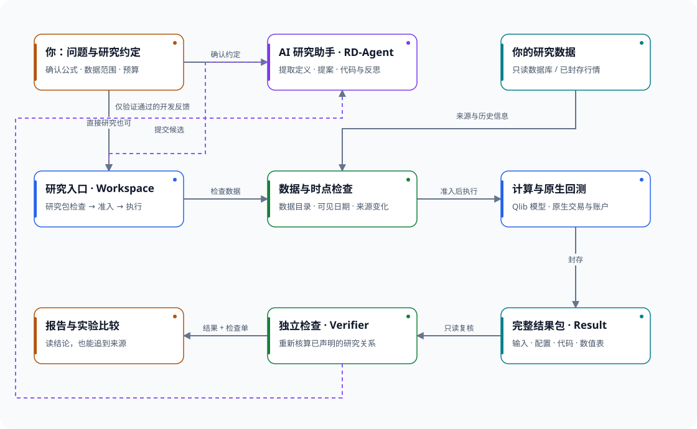
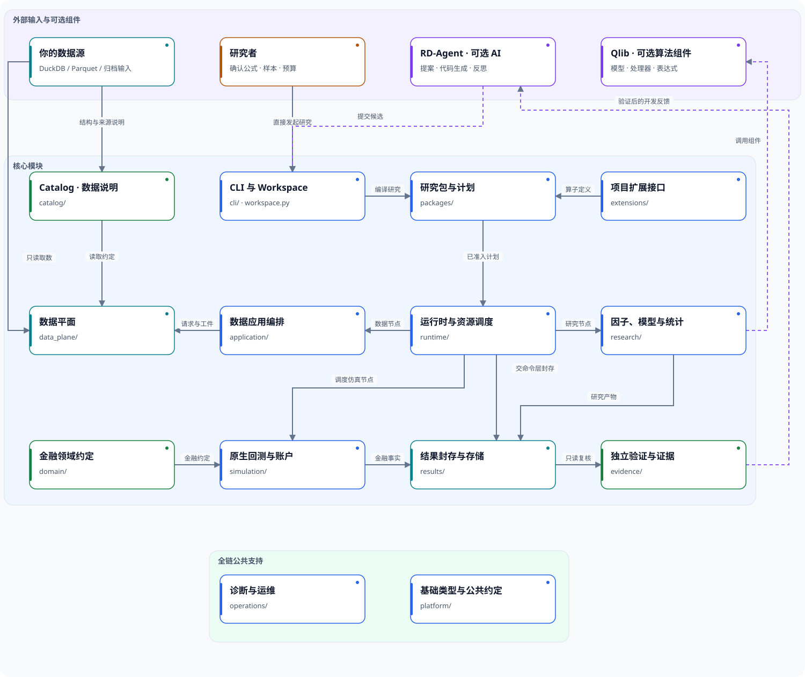
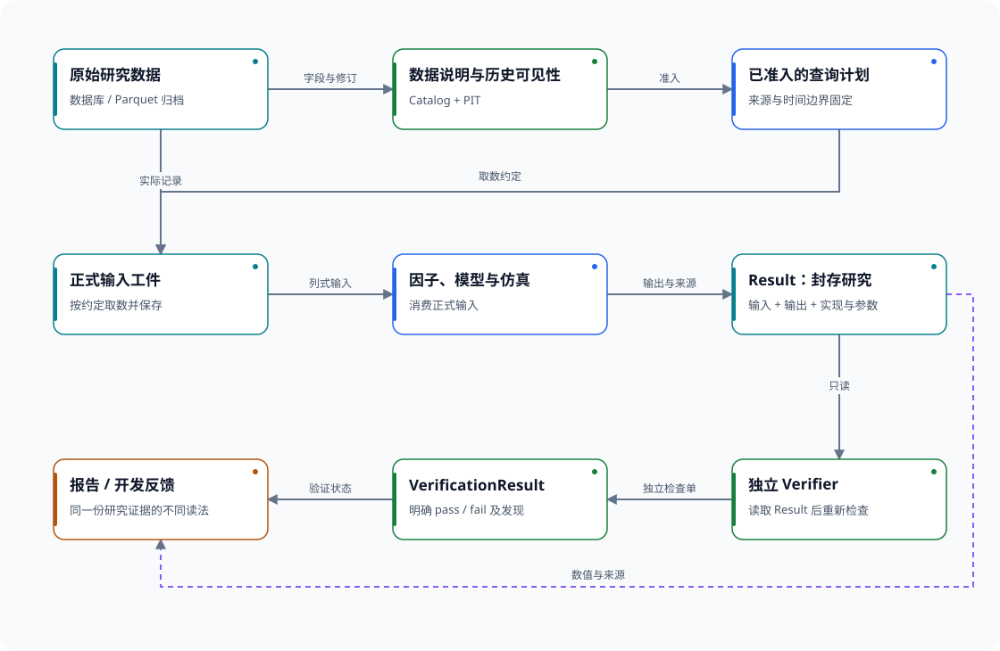
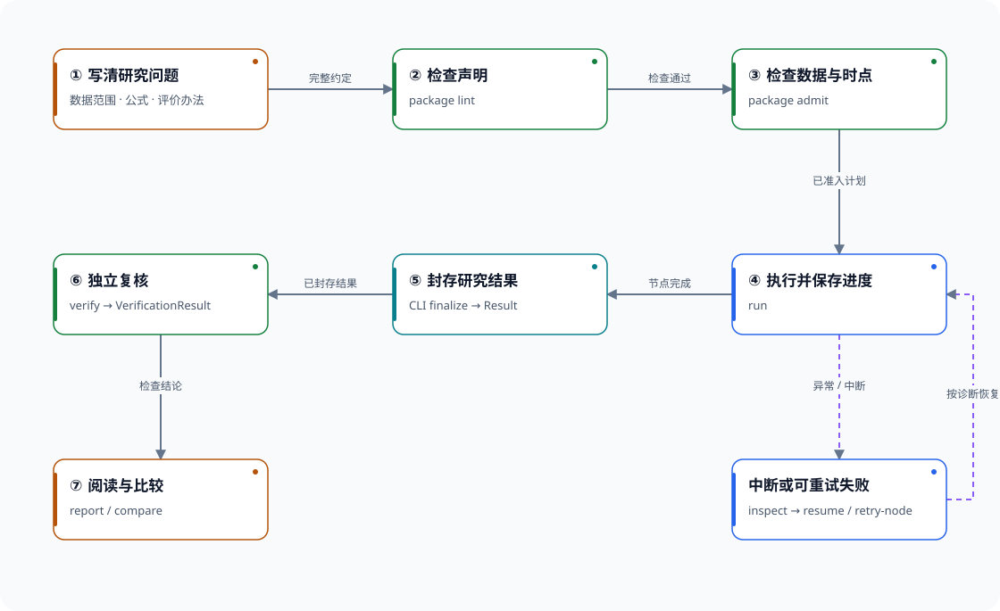
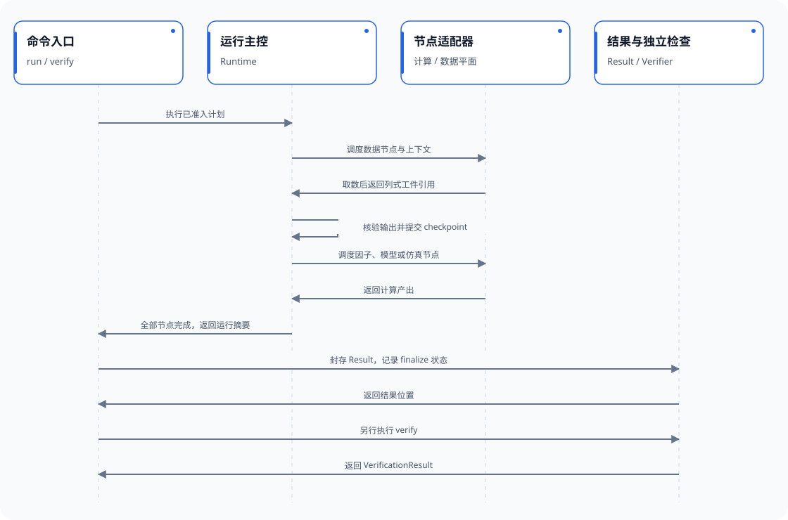
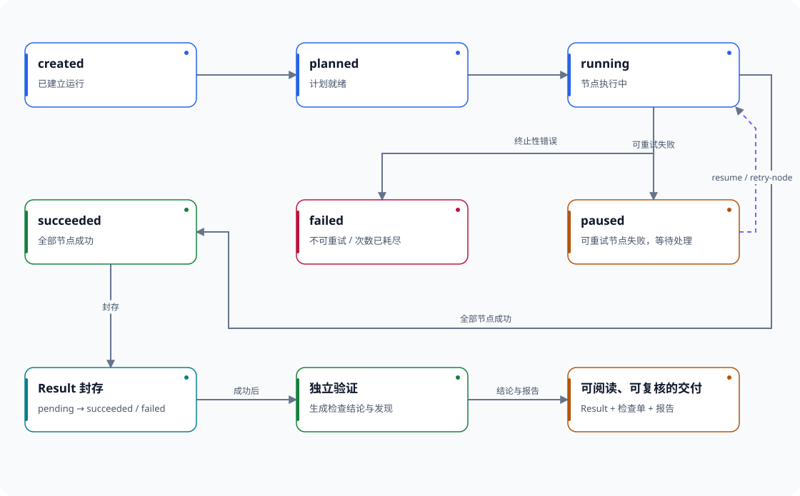

# QuantWitness

### 让 AI 探索，让研究有据可查。

**QuantWitness 是一个 AI 协作的量化研究与回测框架。** 你提供研究问题、论文或研报与数据，它通过可选的 RD-Agent 生成和改进研究代码，把数据检查、因子计算、模型训练、回测和独立验证接成可追溯的实验流程。

目标不只是画出一条好看的收益曲线，而是让你能回答：**用了什么数据？当时能不能知道？试过哪些方案？这个结果能否被另一套检查复核？**

[入门教程](docs/workspace-quickstart.md) · [基本数据接入](docs/catalog.md) · [AI 复现研报](integrations/rdagent/docs/formula-reproduction.md) · [文档导航](docs/index.md) · [框架约定](docs/framework-contracts.md) · [架构图集](docs/architecture/README.md)

[](https://ljjtim.github.io/QuantWitness/overview.html)

*点击图片打开交互架构图，可查看模块职责、上下游和源码位置。在线图册使用 GitHub Pages；离线使用请下载仓库并打开 `docs/architecture/index.html`。*

## 你交给它什么，它交还你什么

| 你要做的事 | QuantWitness 帮你完成 | 最后得到 |
| --- | --- | --- |
| 复现一篇研报中的因子 | 提取指定 PDF 页面的定义，人工确认歧义，生成代码，用独立实现核对公式 | 公式来源、确认记录、候选代码、计算结果及验证结论 |
| 找到更合适的因子或模型 | 在固定数据范围与调用预算内，让 RD-Agent 提案、评价、反思 | 每轮实验记录、开发指标、入选理由；最终留出数据不进入 AI 反馈 |
| 研究股票、ETF 或期货策略 | 按声明的交易时点、市场规则、费用和账户状态进行仿真 | 持仓、资金、订单、成交、费用及风险分析所需的结果表 |
| 接手他人的研究或恢复中断实验 | 保留输入、配置、代码与结果的对应关系，复用已完整提交的步骤 | 可以继续验证、生成报告或追溯来源的研究交付物 |

**三个核心交付物：** `Result` 是实验的完整结果包，`VerificationResult` 是独立检查单，报告是供人阅读的展示。程序跑完和验证通过分别记录，不用一条“成功”掩盖差别。

## 示例：给一份 PDF，复现其中的因子

假设你想研究：“成交量集中在少数分钟的股票，之后的表现是否不同？”

1. **给材料和数据。** 指定 PDF 中的公式页，准备分钟行情、交易日历和数据说明。框架不会替你猜证券池、频率或交易规则。
2. **AI 提取，人来确认。** 把“如何计算”变成待审阅说明，保留页码与原文位置。你确认窗口、缺失值、停牌和信号可用时点。
3. **RD-Agent 写代码。** 在固定接口与预算内生成、修复候选；复现任务不能为了收益更高而改写确认过的公式。
4. **QuantWitness 执行与复核。** 检查数据当时是否可见，运行研究，再由不调用候选实现的验证器重新核算。
5. **拿到可追溯结果。** 从报告回到结果表、候选代码、确认记录和论文来源。若要检验预测力或交易收益，再明确标签、样本外划分、成交与费用假设。

仓库自带一个**无需购买数据、无需付费模型调用的教学案例**：

> 两只虚构证券、五个交易日、2,400 条合成分钟记录。由自编 PDF 定义成交量集中度 `C = Σvᵢ² / (Σvᵢ)²`；先给出一个故意加错数的候选，再用正确候选通过独立复算。均匀成交一天 240 根分钟线时，日指标应为 `1/240`。

[运行这个教学案例](integrations/rdagent/examples/volume_concentration/README.md) · [换成自己的 PDF 与实时模型](integrations/rdagent/docs/formula-reproduction.md)

教学案例使用固定响应演示真实调度与验证流程，不冒充实时 AI 推理。真实 PDF 场景需要模型服务、已有研究包、数据来源和对应的独立验证器；目前不是“上传任意论文就全自动复现”。

## 示例：让 AI 继续提出新研究

复现回答“有没有实现对”；探索回答“还值得试什么”。两者使用不同目标。

```text
你：在固定开发样本中探索收盘价因子，并限制实验轮数与模型调用预算。
         ↓
RD-Agent：提出因子或模型方案，生成候选代码
         ↓
QuantWitness：检查数据时点 → 运行 → 独立验证
         ↓
只把通过验证的开发指标返回给 RD-Agent → 决定下一轮
         ↓
选定方案后，另行执行最终留出样本评价
```

可选入口包括[因子研究](integrations/rdagent/docs/factor-research.md)、[生成式模型研究](integrations/rdagent/docs/model-research.md)和[因子与模型联合研究](integrations/rdagent/docs/joint-research.md)。当前各入口有明确的表达式、模型结构和数据范围，不代表任意策略代码都能自动验证。

## 为什么不直接写一个回测脚本

- **避免“今天知道的事，昨天就拿来交易”。** 用公告或可见日期对齐数据；盘中使用已完成的行情条目。训练处理器只拟合允许的训练样本，最终留出集不参与 AI 迭代。这称为时点一致性，或 PIT（Point-in-Time）。
- **避免“换了数据，却以为复现了同一实验”。** 研究范围、输入来源、参数和实现随计划固定；关键来源变化会阻止继续使用原计划。
- **避免“跑出来了，就当它是对的”。** 独立验证检查已声明的公式、时间与金融关系，失败会留下具体发现。
- **避免“机器中断，前面全白跑”。** 已完整提交的步骤可以复用；未完成或身份不一致的输出不能冒充缓存命中。
- **避免“AI 反复看最终答案”。** 开发反馈与最终评价分开，记录候选、预算和数据消费过程。

这些机制依赖正确的数据说明和具体研究的验证范围，不能凭空证明供应商历史数据准确，也不能保证策略盈利。

## 六张图看懂框架

开头的**总体概览图**回答“它能帮我完成什么”。下面五张图进一步解释模块组成、数据来源、操作顺序和运行状态。README 中的六张图是简明预览；点击任一图片，直接打开对应的详细交互 HTML，查看完整节点、连线和说明。详细版支持主题与风格切换、动态连线、搜索和关系追踪。

### 1. 总体架构：模块怎样协作

14 个核心模块分工明确：RD-Agent 经正式入口提交研究，Qlib 提供算法组件，运行时调度数据和计算，结果再交给独立验证。

[](https://ljjtim.github.io/QuantWitness/research-pipeline-architecture.html)

### 2. 数据流：结果从哪里来

从原始数据、数据说明和准入计划，到正式输入、结果包及检查单，保留可追溯的关联。

[](https://ljjtim.github.io/QuantWitness/dataflow-research-lineage.html)

### 3. 工作流：一次研究怎么完成

按研究说明、检查、准入、执行、封存、验证和报告逐步完成；遇到中断再进入诊断与恢复。

[](https://ljjtim.github.io/QuantWitness/workflow-research-task.html)

### 4. 时序图：运行时谁先调用谁

以普通列式取数路径为例，区分命令层、运行时、节点适配器、结果封存和独立验证。

[](https://ljjtim.github.io/QuantWitness/sequence-research-run.html)

### 5. 状态图：怎样判断真正完成

程序运行、结果封存和验证各有状态。节点跑完，并不自动代表整项研究已经通过检查。

[](https://ljjtim.github.io/QuantWitness/lifecycle-research-run.html)

六张图的离线入口和维护说明见[交互图册](docs/architecture/README.md)。

## 与熟悉的框架如何配合

这些工具并非互相排斥，下面比较的是各自主要关注点，而不是断言其他框架没有某项能力。

| 工具 | 主要关注点 | 在 QuantWitness 中的位置 |
| --- | --- | --- |
| [Qlib](https://github.com/microsoft/qlib) | 面向 AI 的量化研究平台，提供数据、特征、模型与评估组件 | 复用模型、处理器、因子表达式与部分组合组件；由本框架统一约束数据时点与结果交付 |
| [RQAlpha](https://github.com/ricequant/rqalpha) | 可扩展的事件驱动回测与交易框架 | 借鉴市场和账户职责划分；本框架使用自己的仿真与独立复核实现，不直接调用 RQAlpha 引擎 |
| [RD-Agent](https://github.com/microsoft/RD-Agent) | 自动提出、实现和改进数据与模型研究 | 位于可选 AI 提案层，经固定接口提交实验、接收开发反馈 |
| **QuantWitness** | **把人和 AI 的实验变成按时点执行、可追溯、可独立检查的研究结果** | 连接提案、数据、计算、金融仿真与研究交付；重点是实验过程与结果的可信边界 |

## 开始使用

建议先跑合成数据示例，看懂交付物，再接自己的数据，最后加入 AI。

```bash
git clone https://github.com/ljjtim/QuantWitness.git
cd QuantWitness
python -m pip install -e ".[dev]" "pyarrow==21.0.0"
python -m research_pipeline --help
```

核心要求 **Python 3.10+**。模型研究需要可选 Qlib 依赖；RD-Agent 集成要求 **Python 3.11+**，并有单独的调度环境要求。安装时请按对应指南，不必为了第一次研究安装所有 AI 依赖。

| 下一步 | 阅读入口 |
| --- | --- |
| 不接模型服务，先得到一份结果与验证报告 | [合成研究入门](docs/workspace-quickstart.md) |
| 我有自己的数据和研究问题 | [基本数据接入](docs/catalog.md) → [创建研究](docs/getting-started.md) |
| 我想复现论文、探索因子或模型 | [AI 研究指南](docs/ai_workflow.md) → [RD-Agent 安装与场景](integrations/rdagent/README.md) |
| 我关心交易规则与账户处理 | [金融仿真](docs/financial_simulation.md) → [真实覆盖与验收](docs/native_backtest_acceptance.md) |
| 我想看系统内部如何工作 | [六张交互图](docs/architecture/README.md) → [模块边界](docs/architecture.md) |

## 当前范围

- 支持声明式研究流程、日频模型研究、股票／ETF／期货的已实现仿真路径；具体市场、频率、账户事件与验证范围见对应文档。期权、完整融券、组合保证金优惠和实物交割不在当前通用能力承诺中。
- 研究阶段只读访问数据。行情采集、数据库写入和实盘交易不属于这条研究流程。
- 不附带真实行情或个人数据库配置。合成示例用于理解和验证工程行为，不能作为投资效果证明。
- 独立验证针对声明的规则与检查范围；自定义算法需要相应验证实现。目前没有免配置适用于一切策略的公共 Recipe。

<details>
<summary>查看精确能力状态与适用边界</summary>

状态以 `src/research_pipeline/capabilities.json` 为准。`local_only` 表示已有本地实现／验收，不能解读为覆盖所有市场和机器的发行认证；`planned` 表示尚不可据此执行。

<!-- CAPABILITIES_TABLE:START -->
| capability | 状态 | 命令 | 证据 / 信任 | 边界说明 |
| --- | --- | --- | --- | --- |
| `catalog.lock` | `local_only` | `catalog` | `local_acceptance` / `local_only` | Catalog 编译、锁定和漂移检查由显式来源文件驱动；公开仓库不附带个人 Catalog 或独立发布验收记录。 |
| `research_package.plan` | `local_only` | `package lint`<br>`package admit` | `local_acceptance` / `local_only` | ResearchPackage 只能声明受控合同，不接受自由 SQL、动态模块或项目 runner。lint 一次返回声明、算子、指标、结果和准入缺口；admit 从显式只读数据源生成漂移/PIT 闭包并在发布/加载时校验准入事实。 |
| `runtime.recovery` | `local_only` | `resume`<br>`retry-node`<br>`inspect`<br>`rerun-from`<br>`run --reuse-run-root`<br>`run --require-reused-node`<br>`run --reuse-failed-run-root`<br>`workspace run --reuse-run-root`<br>`workspace run --require-reused-node`<br>`workspace run --reuse-failed-run-root` | `local_acceptance` / `local_only` | resume、retry-node、inspect 和 rerun-from 消费当前 invocation、计划内算子闭包和已验证 checkpoint；run 与 workspace run 共用复用参数和正式运行校验；--reuse-run-root 只按显式顺序接受现行节点局部身份下已成功发布 Result 的完成态 run，并机会式复用 pure/cacheable 节点。配合 --require-reused-node 时，指定节点及其必要上游允许不是 pure/cacheable，但必须在 Worker 启动前全部通过节点局部身份、输入、checkpoint、typed 输出和 ExternalArtifact 内容复验，且不得回退执行。run --reuse-failed-run-root 只接受一个显式失败终态 run，要求新旧 DAG、节点身份环境、clock 和 seed 完全一致，只把状态为成功且完整复验通过的 checkpoint 复制进目标 run，再从首个未成功节点继续。两种跨运行来源不能混用，不扫描磁盘或依赖裸 ResultStore。同一次 execute 复用 Supervisor 已冻结的工件验证结果，新的 resume 进程、rerun child 或新 run 必须重新完整验证。多请求 data 节点另以 run 内 partial index 逐项复验已提交 DatasetArtifactRef，只重做失效 request；partial 不进入正式输出。旧计划仍可 inspect/resume/retry，但不能开启跨运行复用。该边界仍为 local_only。 |
| `evidence.consume` | `local_only` | `verify`<br>`report`<br>`export-result`<br>`compare`<br>`analysis run`<br>`analysis compare` | `local_acceptance` / `local_only` | verify 直接从自包含 Result 生成结构化 VerificationResult；report、compare、analysis、export-result 和 Dashboard 不依赖 run-root。analysis run 只消费 status=pass 的 VerificationResult，要求外部请求显式声明表列、窗口、值语义、频率、单位、费用口径和处理政策，只投影日期和值两列并生成独立 AnalysisResult，不修改 Result、VerificationResult 或 claim。analysis compare 只对同规格、同实际窗口和同 claim 事实的 AnalysisResult 排名，任一必要事实不一致时不输出部分排名。直接 compare 仍只比较已验证指标事实并明示未检查 package 合同；package compare 由 delivery 唯一检查 metric/claim 合同。export-result 仅复制并复核已验证 Result，不重新执行研究。该合同尚未通过独立发布验收，因此保持 local_only。 |
| `evidence.validity_recompute` | `local_only` | `verify` | `local_acceptance` / `local_only` | 独立 verify 从已封存的 canonical 六表与 Bar TCA 四表复核金融守恒、费用与 lineage；金融 oracle 使用有界 Arrow 批次和受配额 DuckDB 扫描，篡改或资源不足均阻止生成 VerificationResult。公开源码提供合同测试，不附带个人真实数据 Result 或独立发布验收；能力保持 local_only，不代表策略盈利、实盘成交或可交易性。 |
| `operator_graph.generic_run` | `local_only` | `run`<br>`resume`<br>`retry-node`<br>`inspect` | `local_acceptance` / `local_only` | 正式 run 由 Runtime v2 调度，节点返回按端口索引的 typed refs，checkpoint 绑定全部端口；成功后唯一 finalize 自包含 Result，再由独立 verify 生成 VerificationResult。该边界尚缺独立发布验收，因此仍是 local_only。 |
| `research.walk_forward_model` | `local_only` | `package admit`<br>`run` | `local_acceptance` / `local_only` | Qlib 六节点负责日频回归模型：Linear、LightGBM、XGBoost；Processor 与 Model 按候选/fold 一起训练保存。保留 purge/embargo、开发区 validation 选择及隔离 holdout；模型文件随 Result 封存。只接受 v2 模型工件，不恢复旧七阶段 ML checkpoint。本地技术验收不代表真实策略、可交易性或样本外盈利。 |
| `minute_line.complete` | `local_only` | `run` | `local_acceptance` / `local_only` | 四类中国市场资产可按当前 Catalog、已完成分钟 bar、PIT 快照与历史规则进入同一研究主链；随包规则仅覆盖文档列明的参考标的及窗口，范围外无默认规则。公开源码提供合同与合成示例，不附带真实分钟数据或研究结果；能力保持 local_only，不代表全历史、全品种或实盘可交易。 |
| `minute_line.real_data_smoke` | `local_only` | `run` | `local_acceptance` / `local_only` | 公开包提供四资产分钟输入和只读 Result/VerificationResult 合同，不附带供应商原始数据或个人真实运行收据。真实数据观察须由使用者在自己的来源、窗口和规则下重新执行并独立验证；当前能力只到 local_only，不宣称供应商历史版本精确重放或分钟交易仿真。 |
| `simulation.bar_tca` | `local_only` | `package admit`<br>`run` | `local_acceptance` / `local_only` | Bar TCA 只消费统一 SimulationResult 的正式订单与成交和账本身份，不二次撮合。分钟路径要求决策时可见基准、已完成执行 bar、可见容量与正式 fill，缺任何必要事实均失败关闭。随包参考规则只有有界中国市场标的窗口；公开源码不包含个人真实研究结果，能力保持 local_only。 |
| `capability.discovery` | `local_only` | `capabilities --format json`<br>`operator list/describe/scaffold/validate/build`<br>`artifact describe`<br>`recipe list/describe/scaffold`<br>`catalog dataset/field search`<br>`package lint`<br>`package expand-variants` | `local_acceptance` / `local_only` | capabilities 命令逐字段读取本清单；operator、artifact、catalog 和 package lint 的发现结果来自正式 registry、schema、Catalog Lock 或 package compiler。package expand-variants 只覆盖基包中已存在的 node 参数，原子生成普通完整包，不接受深层 YAML 合并、模板、Python 或 SQL。当前没有获准的公共 recipe，使用 package init 创建通用起点；项目完整拓扑由 ResearchPackage 声明。operator scaffold 生成可验证的最小项目算子；正式 Feature/Label 需必填 causal_plan，且来源必须可由已准入请求证明。validate/build 只复验显式源码闭包，不扫描目录或自动安装。 |
| `resource.governance` | `local_only` | `run --resource-state-dir` | `local_acceptance` / `local_only` | 数据节点预算先编译为 DuckDB、batch/writer 与进程余量；当前 provider 支持包络下限为 256 MiB，低于下限在对象统计和扫描前拒绝。完整矩阵消费者用 footer 做数据页前的明显超界拒绝；内部 worker 默认 1 个，显式指定不能超过 CPU 或 max_workers 容量，并共用节点总预算。全新隔离进程中的真实 DuckDB/Parquet/Arrow 探针回归整个进程树 RSS、读取量与 temp 峰值，不把局部公式称为任意 allocator 的硬上界。多个 CLI/worker 的 FIFO 租约与父子令牌仍共用总容量；资源不足不改变样本、频率、参数或 seed。合成探针不进入正式运行校准总体。 |
<!-- CAPABILITIES_TABLE:END -->

</details>

## 开源与贡献

QuantWitness 自有代码采用 **Apache-2.0**。Qlib 与 RD-Agent 等上游组件保留各自许可证，详见[第三方说明](THIRD_PARTY_NOTICES.md)。欢迎从可手算的新研究示例、独立验证器、数据接入或文档改进开始：[贡献指南](CONTRIBUTING.md)。
